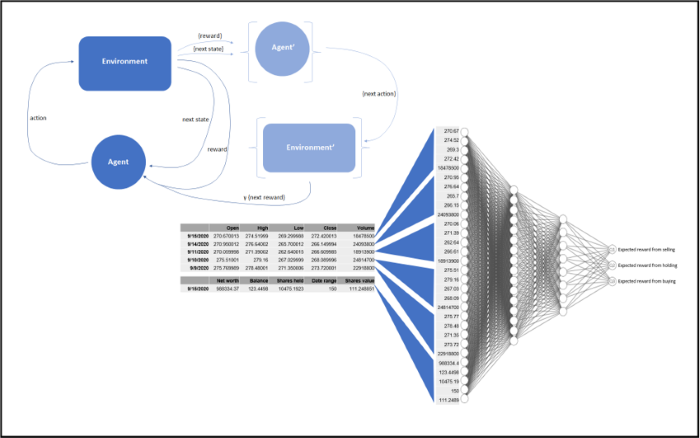
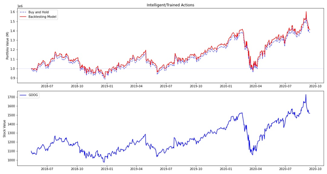

# GA Capstone: Automated Stock Trading Agent

---

#### Repository Contents

 - `assets`
   - Supporting files and images for presentation purposes
 - `models`
   - Saved model parameters and networks specific to certain stock
 - `support_code`
   - `env.py`: The stock trading environment used for backtesting and training
   - `model.py`: The DQN framework for training agents
   - `functions.py`: Supporting functions used repeatedly across testing notebooks
 - `db_build.ipynb`
   - The notebook for aggregating and saving all stock histories to be used by the backtesting environment
 - `final_demo.ipynb`
   - The notebook for visualizing and demonstrating the results of trained models
 - `testing_double-DQN.ipynb`
   - The notebook for training and testing a Double DQN model. This model uses a different environment that has a continuous action space
 - `testing_DQN-2.ipynb`
   - The notebook for training and testing a DQN model with a deeper neural network
 - `testing_DQN-augm-dta.ipynb`
   - The notebook for training and testing a DQN model that augments environmental data to help the agent learn
 - `testing_DQN.ipynb`
   - The notebook for training and testing a DQN model with a shallower but larger neural network. This is the base model
 - `ticker_data.db`
   - The database file containing tables for each *FANG* stock history
   
---

## Problem

Can an intelligent stock trading agent be trained in a backtesting simulation environment to learn how to profitably trade stocks and automate the process of portfolio management? Reinforcement Learning AI techniques will be employed to train a Deep Q-Network on the historical prices of the *FANG* technology leaders. The goal of the model is not to predict prices, but rather to predict quantities of shares to trade such that a long term profit will be achieved.

## Data

Data used to populate the backtesting environment come from Yahoo Finance:
 - Facebook: [FB](https://finance.yahoo.com/quote/FB/history?period1=1337299200&period2=1601424000&interval=1d&filter=history&frequency=1d)
 - Apple: [AAPL](https://finance.yahoo.com/quote/AAPL/history?period1=345427200&period2=1601424000&interval=1d&filter=history&frequency=1d)
 - Netflix: [NFLX](https://finance.yahoo.com/quote/NFLX/history?period1=1022112000&period2=1601424000&interval=1d&filter=history&frequency=1d)
 - Google: [GOOG](https://finance.yahoo.com/quote/GOOG/history?period1=1092873600&period2=1601424000&interval=1d&filter=history&frequency=1d)
 
For simplicity, the environment will only observe prices starting in 2009. This will ensure that data series are of the same length (except for **FB**, which had its IPO in 2012). It will also avoid the market shock of the 2008 Financial Crisis, a feature which could cause difficulty for training the model. Prices and volume will be fed to the agent normalized between 0 and 1 (as determined by the highest price/volume yet seen in backtesting).

## Backtesting Environment

The backtesting/simulation environment used in training the agent to trade stocks is roughly based on a trading environment built by [Adam King](https://github.com/notadamking/Stock-Trading-Environment). The environment is built to model OpenAI's framework for reinforcement learning. It inherits OpenAI's `Gym` class and offers the user-facing methods `reset`, `step`, and `render`. Currently it only supports one stock at a time, but the the environment will continue to be developed to support a portfolio of multiple stocks. The environment has a continuous observation space and a discrete action space.

The `reset` method initializes a new episode of trading. If the environment's `training` parameter is turned on, the current step is set to a random point in the given stock's history (before the specified train-test split point). If the parameter is turned off, the current step is set to the specified train-test split point in the given stock's history. 

The `step` method accepts an `action` argument from the agent and returns the next state, the reward from the action, the terminal status of the episode, and an empty dictionary (OpenAI's environments typically return a dictionary of meta-info instead of an empty one). The `action` argument is an index value of the environment's action space. Possible actions include buying, holding, and selling different portions of the portfolio. Trades are executed at the current step's closing price. States are returned as a *6x5* matrix containing the Open, High, Low, Close, and Volume markers for the most recent five days. The *OHLC* prices are scaled by dividing each by the highest price yet seen in the episode. The volume indicator is divided by the highest volume yet seen. The last row of the state matrix is information about the portfolio's current status, including: net worth divided by initial net worth, balance divided by initial balance, the number of shares held, the number of steps so far taken in the episode, and the number of shares held divided by the current price. The reward is equal to the hypothetical profit of a "buy and hold" strategy minus the agent's actual profit all divided by the initial balance.

The `render` method will display the portfolio balance, net worth, shares held, profit, day range, and current *OHLCV* markers for the current day.

## Modeling

Several different agents were tested on different stocks. One agent is a DQN model that uses augmented state information in order to improve performance with "prior knowledge". Another agent is an embedded Double-DQN model that uses two neural networks to predict a continuous action space. Another agent is a basic DQN model. The basic DQN model was tested with two different neural network architectures. One has two hidden layers with 1,528 nodes and 1,032 nodes respectively. The other has three hidden layers with 942 nodes, 360 nodes, and 70 nodes respectively.

The best agent was the basic DQN model with a two-layer neural network. This agent was trained with 2,500 episodes of backtesting. Its performance on the **GOOG** test set (the later 20% of the stock history) is displayed below. The top panel of the figure shows the agent's performance in red compared to the performance of the buy and hold strategy in dashed blue. The agent consistently performed just above the buy and hold strategy.

The initial balance of the backtesting portfolio was $1,000,000. The model trained in Google backtesting performed roughly 3% better than the buy and hold strategy over a period of roughly 2.5 years, resulting in $30,733 more in profit. The buy and hold strategy of the Google stock performed 13% worse than a buy and hold strategy on the S&P 500 index. The model trained in Google backtesting performed only 11% worse than a buy and hold strategy on the S&P 500 index. The model's active management of the Google stock alone performed $24,795 closer to the S&P 500 index on average than the passive management of Google stock.

## Next Steps

 - The environment can be modified and improved to support the trade of multiple stocks at once, instead of just one.
 - The environment can be modified to allow a continuous action space. This will allow for testing of Deep Deterministic Policy Gradients or embedded Double DQNs.
 - A separate forecasting model can be built separate from the agent. This will allow price predictions to be fed to the agent alongside environment state observations. 

---

#### Related Reading

 - https://towardsdatascience.com/creating-a-custom-openai-gym-environment-for-stock-trading-be532be3910e
 - https://papers.ssrn.com/sol3/papers.cfm?abstract_id=3690996
 - https://arxiv.org/ftp/arxiv/papers/1803/1803.03916.pdf
 
